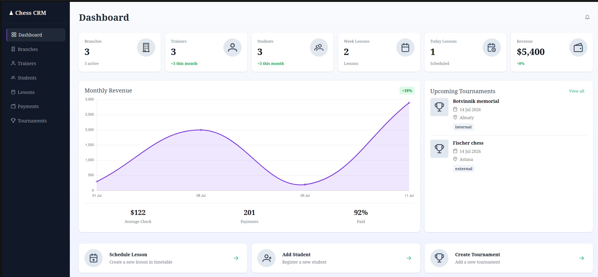
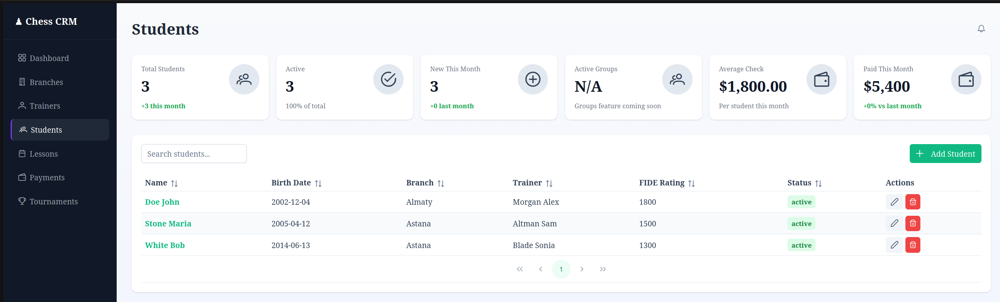
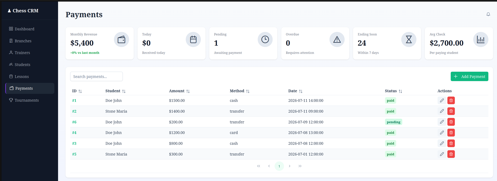

# Chess CRM

CRM system for managing a chess school: branches, trainers, students, lessons, payments and tournaments — with a live analytics dashboard.

Built as a portfolio project to learn the Laravel + Inertia + Vue stack.





## Features

- **Dashboard** — key metrics at a glance: students, trainers, branches, today's and this week's lessons, monthly revenue with month-over-month change, upcoming tournaments, revenue chart
- **Students** — full CRUD, branch assignment, many-to-many trainer assignment, parent contacts, FIDE/local ratings
- **Trainers** — profiles with specialization, linked students
- **Branches** — capacity and occupancy tracking, per-branch revenue and lesson stats
- **Lessons** — scheduling with status tracking (incl. cancellations)
- **Payments** — payment history per student, monthly revenue, average check, pending/overdue statuses
- **Tournaments** — tournament calendar and per-student results

## Tech Stack

| Layer    | Tech                                            |
| -------- | ----------------------------------------------- |
| Backend  | PHP 8.3, Laravel 13                             |
| Frontend | Vue 3, Inertia.js, PrimeVue, Tailwind CSS       |
| Database | PostgreSQL 16                                   |
| Cache    | Redis                                           |
| Auth     | Laravel Breeze                                  |
| Build    | Vite                                            |
| Infra    | Docker Compose (app + nginx + postgres + redis) |

## Getting Started

### With Docker (recommended)

```bash
git clone https://github.com/khantuevandrei/chess-crm.git
cd chess-crm

docker compose up -d --build

# install dependencies, generate app key, run migrations, build assets
docker compose exec app composer setup
```

The app is available at http://localhost:8080.

### Local (without Docker)

Requires PHP 8.3+, Composer, Node.js 20+ and a running PostgreSQL instance.

```bash
git clone https://github.com/khantuevandrei/chess-crm.git
cd chess-crm

cp .env.example .env
# set your DB credentials in .env, then:

composer setup    # composer install, key:generate, migrate, npm install, npm run build
composer dev      # starts server, queue, logs and Vite in one command
```

## Running Tests

```bash
php artisan test
# or inside Docker:
docker compose exec app php artisan test
```

Feature tests cover CRUD and validation for students, branches, trainers, lessons and payments.

## Code Style

Laravel Pint:

```bash
vendor/bin/pint
```

## License

MIT
